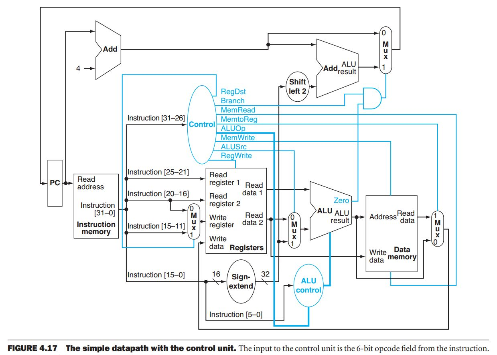

# Lab 3 - The Datapath Control Unit

## Introduction

For this lab you will be building the control units for a MIPS processor. See the next figure.



There are two control units. The _main control unit_ manages the datapath. It receives an opcode
input from the currently executing instructions and based on this opcode it configures the
datapath accordingly. A truth table for the unit functionality (shown below) can be found in the
slides of CS161. The table (read vertically) shows the output for `R-format`, `lw`, `sw` and
`beq` instructions, additionally, you will need to implement the immediate type `addi`
instruction. To do this, you will trace through the datapath (shown above) to determine which
control lines will need to be set.

<table style="border-collapse: collapse; width: 98%; height: 496px;" border="1">
    <tbody>
        <tr style="height: 31px; background-color: #c2e0f4;">
            <td style="width: 14.2764%; height: 31px; text-align: center;"><strong>Control</strong></td>
            <td style="width: 14.2764%; height: 31px; text-align: center;"><strong>Signal name</strong></td>
            <td style="width: 14.2749%; height: 31px; text-align: center;"><strong>R-format</strong></td>
            <td style="width: 14.2764%; height: 31px; text-align: center;"><strong>lw</strong></td>
            <td style="width: 14.2749%; height: 31px; text-align: center;"><strong>sw</strong></td>
            <td style="width: 14.2764%; height: 31px; text-align: center;"><strong>beq</strong></td>
            <td style="width: 14.2749%; height: 31px; text-align: center;"><strong>addi</strong></td>
        </tr>
        <tr style="height: 31px;">
            <td style="width: 14.2764%; height: 186px; text-align: center;" rowspan="6"><strong>Inputs</strong></td>
            <td style="width: 14.2764%; height: 31px; text-align: right;">Op5</td>
            <td style="width: 14.2749%; height: 31px; text-align: center;">0</td>
            <td style="width: 14.2764%; height: 31px; text-align: center;">1</td>
            <td style="width: 14.2749%; height: 31px; text-align: center;">1</td>
            <td style="width: 14.2764%; height: 31px; text-align: center;">0</td>
            <td style="width: 14.2749%; height: 31px; text-align: center;">0</td>
        </tr>
        <tr style="height: 31px;">
            <td style="width: 14.2764%; height: 31px; text-align: right;">Op4</td>
            <td style="width: 14.2749%; height: 31px; text-align: center;">0</td>
            <td style="width: 14.2764%; height: 31px; text-align: center;">0</td>
            <td style="width: 14.2749%; height: 31px; text-align: center;">0</td>
            <td style="width: 14.2764%; height: 31px; text-align: center;">0</td>
            <td style="width: 14.2749%; height: 31px; text-align: center;">0</td>
        </tr>
        <tr style="height: 31px;">
            <td style="width: 14.2764%; height: 31px; text-align: right;">Op3</td>
            <td style="width: 14.2749%; height: 31px; text-align: center;">0</td>
            <td style="width: 14.2764%; height: 31px; text-align: center;">0</td>
            <td style="width: 14.2749%; height: 31px; text-align: center;">1</td>
            <td style="width: 14.2764%; height: 31px; text-align: center;">0</td>
            <td style="width: 14.2749%; height: 31px; text-align: center;">1</td>
        </tr>
        <tr style="height: 31px;">
            <td style="width: 14.2764%; height: 31px; text-align: right;">Op2</td>
            <td style="width: 14.2749%; height: 31px; text-align: center;">0</td>
            <td style="width: 14.2764%; height: 31px; text-align: center;">0</td>
            <td style="width: 14.2749%; height: 31px; text-align: center;">0</td>
            <td style="width: 14.2764%; height: 31px; text-align: center;">1</td>
            <td style="width: 14.2749%; height: 31px; text-align: center;">0</td>
        </tr>
        <tr style="height: 31px;">
            <td style="width: 14.2764%; height: 31px; text-align: right;">Op1</td>
            <td style="width: 14.2749%; height: 31px; text-align: center;">0</td>
            <td style="width: 14.2764%; height: 31px; text-align: center;">1</td>
            <td style="width: 14.2749%; height: 31px; text-align: center;">1</td>
            <td style="width: 14.2764%; height: 31px; text-align: center;">0</td>
            <td style="width: 14.2749%; height: 31px; text-align: center;">0</td>
        </tr>
        <tr style="height: 31px;">
            <td style="width: 14.2764%; height: 31px; text-align: right;">Op0</td>
            <td style="width: 14.2749%; height: 31px; text-align: center;">0</td>
            <td style="width: 14.2764%; height: 31px; text-align: center;">1</td>
            <td style="width: 14.2749%; height: 31px; text-align: center;">1</td>
            <td style="width: 14.2764%; height: 31px; text-align: center;">0</td>
            <td style="width: 14.2749%; height: 31px; text-align: center;">0</td>
        </tr>
        <tr style="height: 31px;">
            <td style="width: 14.2764%; height: 279px; text-align: center;" rowspan="9"><strong>Outputs</strong></td>
            <td style="width: 14.2764%; height: 31px; text-align: right;">RegDst</td>
            <td style="width: 14.2749%; height: 31px; text-align: center;">1</td>
            <td style="width: 14.2764%; height: 31px; text-align: center;">0</td>
            <td style="width: 14.2749%; height: 31px; text-align: center;">X</td>
            <td style="width: 14.2764%; height: 31px; text-align: center;">X</td>
            <td style="width: 14.2749%; height: 31px; text-align: center;">?</td>
        </tr>
        <tr style="height: 31px;">
            <td style="width: 14.2764%; height: 31px; text-align: right;">ALUSrc</td>
            <td style="width: 14.2749%; height: 31px; text-align: center;">0</td>
            <td style="width: 14.2764%; height: 31px; text-align: center;">1</td>
            <td style="width: 14.2749%; height: 31px; text-align: center;">1</td>
            <td style="width: 14.2764%; height: 31px; text-align: center;">0</td>
            <td style="width: 14.2749%; height: 31px; text-align: center;">?</td>
        </tr>
        <tr style="height: 31px;">
            <td style="width: 14.2764%; height: 31px; text-align: right;">MemtoReg</td>
            <td style="width: 14.2749%; height: 31px; text-align: center;">0</td>
            <td style="width: 14.2764%; height: 31px; text-align: center;">1</td>
            <td style="width: 14.2749%; height: 31px; text-align: center;">X</td>
            <td style="width: 14.2764%; height: 31px; text-align: center;">X</td>
            <td style="width: 14.2749%; height: 31px; text-align: center;">?</td>
        </tr>
        <tr style="height: 31px;">
            <td style="width: 14.2764%; height: 31px; text-align: right;">RegWrite</td>
            <td style="width: 14.2749%; height: 31px; text-align: center;">1</td>
            <td style="width: 14.2764%; height: 31px; text-align: center;">1</td>
            <td style="width: 14.2749%; height: 31px; text-align: center;">0</td>
            <td style="width: 14.2764%; height: 31px; text-align: center;">0</td>
            <td style="width: 14.2749%; height: 31px; text-align: center;">?</td>
        </tr>
        <tr style="height: 31px;">
            <td style="width: 14.2764%; height: 31px; text-align: right;">MemRead</td>
            <td style="width: 14.2749%; height: 31px; text-align: center;">0</td>
            <td style="width: 14.2764%; height: 31px; text-align: center;">1</td>
            <td style="width: 14.2749%; height: 31px; text-align: center;">0</td>
            <td style="width: 14.2764%; height: 31px; text-align: center;">0</td>
            <td style="width: 14.2749%; height: 31px; text-align: center;">?</td>
        </tr>
        <tr style="height: 31px;">
            <td style="width: 14.2764%; height: 31px; text-align: right;">MemWrite</td>
            <td style="width: 14.2749%; height: 31px; text-align: center;">0</td>
            <td style="width: 14.2764%; height: 31px; text-align: center;">0</td>
            <td style="width: 14.2749%; height: 31px; text-align: center;">1</td>
            <td style="width: 14.2764%; height: 31px; text-align: center;">0</td>
            <td style="width: 14.2749%; height: 31px; text-align: center;">?</td>
        </tr>
        <tr style="height: 31px;">
            <td style="width: 14.2764%; height: 31px; text-align: right;">Branch</td>
            <td style="width: 14.2749%; height: 31px; text-align: center;">0</td>
            <td style="width: 14.2764%; height: 31px; text-align: center;">0</td>
            <td style="width: 14.2749%; height: 31px; text-align: center;">0</td>
            <td style="width: 14.2764%; height: 31px; text-align: center;">1</td>
            <td style="width: 14.2749%; height: 31px; text-align: center;">?</td>
        </tr>
        <tr style="height: 31px;">
            <td style="width: 14.2764%; height: 31px; text-align: right;">ALUOp1</td>
            <td style="width: 14.2749%; height: 31px; text-align: center;">1</td>
            <td style="width: 14.2764%; height: 31px; text-align: center;">0</td>
            <td style="width: 14.2749%; height: 31px; text-align: center;">0</td>
            <td style="width: 14.2764%; height: 31px; text-align: center;">0</td>
            <td style="width: 14.2749%; height: 31px; text-align: center;">?</td>
        </tr>
        <tr style="height: 31px;">
            <td style="width: 14.2764%; height: 31px; text-align: right;">AluOp0</td>
            <td style="width: 14.2749%; height: 31px; text-align: center;">0</td>
            <td style="width: 14.2764%; height: 31px; text-align: center;">0</td>
            <td style="width: 14.2749%; height: 31px; text-align: center;">0</td>
            <td style="width: 14.2764%; height: 31px; text-align: center;">1</td>
            <td style="width: 14.2749%; height: 31px; text-align: center;">?</td>
        </tr>
    </tbody>
</table>

**Table 1.** The control function for the simple one-clock implementation. Read each column
vertically. I.e. if the `Op[5:0]` is `000000`, the `RegDst` would be ‘`1`’, `ALUSrc` would be ‘`0`’, etc.
You will need to fill in the `imm` column. Based on Figure D.2.4 from the book.

The second control unit manages the _ALU_. It receives an ALU opcode from the datapath
controller and the ‘`Funct Field`’ from the current instruction. With these, the ALU controller
decides what operation the ALU is to perform. The following figures from the CS161 slides give
an idea of the inputs and outputs of the ALU controller.

<table style="border-collapse: collapse; width: 98%;" border="1">
    <tbody>
        <tr>
            <td style="width: 66.6202%; text-align: center; background-color: #c2e0f4;" colspan="4"><strong>Input</strong></td>
            <td style="width: 33.3101%; text-align: center; background-color: #c2e0f4;" colspan="2"><strong>Output</strong></td>
        </tr>
        <tr>
            <td style="width: 16.6558%; text-align: center; background-color: #c2e0f4;"><strong>Instruction Code</strong></td>
            <td style="width: 16.6543%; text-align: center; background-color: #c2e0f4;"><strong>ALUOp</strong></td>
            <td style="width: 16.6558%; text-align: center; background-color: #c2e0f4;"><strong>Instruction operation</strong></td>
            <td style="width: 16.6543%; text-align: center; background-color: #c2e0f4;"><strong>Funct field</strong></td>
            <td style="width: 16.6558%; text-align: center; background-color: #c2e0f4;"><strong>Desired ALU action</strong></td>
            <td style="width: 16.6543%; text-align: center; background-color: #c2e0f4;"><strong>ALU select input</strong></td>
        </tr>
        <tr>
            <td style="width: 16.6558%; text-align: right;">addi</td>
            <td style="width: 16.6543%; text-align: center;"><span style="font-family: 'andale mono', times;">??</span></td>
            <td style="width: 16.6558%;">Add Immediate</td>
            <td style="width: 16.6543%; text-align: center;"><span style="font-family: 'andale mono', times;">XXXXXX</span></td>
            <td style="width: 16.6558%;">add</td>
            <td style="width: 16.6543%; text-align: center;"><span style="font-family: 'andale mono', times;">0010</span></td>
        </tr>
        <tr>
            <td style="width: 16.6558%; text-align: right;">lw</td>
            <td style="width: 16.6543%; text-align: center;"><span style="font-family: 'andale mono', times;">00</span></td>
            <td style="width: 16.6558%;">Load word</td>
            <td style="width: 16.6543%; text-align: center;"><span style="font-family: 'andale mono', times;">XXXXXX</span></td>
            <td style="width: 16.6558%;">add</td>
            <td style="width: 16.6543%; text-align: center;"><span style="font-family: 'andale mono', times;">0010</span></td>
        </tr>
        <tr>
            <td style="width: 16.6558%; text-align: right;">sw</td>
            <td style="width: 16.6543%; text-align: center;"><span style="font-family: 'andale mono', times;">00</span></td>
            <td style="width: 16.6558%;">Store word</td>
            <td style="width: 16.6543%; text-align: center;"><span style="font-family: 'andale mono', times;">XXXXXX</span></td>
            <td style="width: 16.6558%;">add</td>
            <td style="width: 16.6543%; text-align: center;"><span style="font-family: 'andale mono', times;">0010</span></td>
        </tr>
        <tr>
            <td style="width: 16.6558%; text-align: right;">beq</td>
            <td style="width: 16.6543%; text-align: center;"><span style="font-family: 'andale mono', times;">01</span></td>
            <td style="width: 16.6558%;">Branch equal</td>
            <td style="width: 16.6543%; text-align: center;"><span style="font-family: 'andale mono', times;">XXXXXX</span></td>
            <td style="width: 16.6558%;">subtract</td>
            <td style="width: 16.6543%; text-align: center;"><span style="font-family: 'andale mono', times;">0110</span></td>
        </tr>
        <tr>
            <td style="width: 16.6558%; text-align: right;">R-type</td>
            <td style="width: 16.6543%; text-align: center;"><span style="font-family: 'andale mono', times;">10</span></td>
            <td style="width: 16.6558%;">add</td>
            <td style="width: 16.6543%; text-align: center;"><span style="font-family: 'andale mono', times;">100000</span></td>
            <td style="width: 16.6558%;">add</td>
            <td style="width: 16.6543%; text-align: center;"><span style="font-family: 'andale mono', times;">0010</span></td>
        </tr>
        <tr>
            <td style="width: 16.6558%; text-align: right;">R-type</td>
            <td style="width: 16.6543%; text-align: center;"><span style="font-family: 'andale mono', times;">10</span></td>
            <td style="width: 16.6558%;">subtract</td>
            <td style="width: 16.6543%; text-align: center;"><span style="font-family: 'andale mono', times;">100010</span></td>
            <td style="width: 16.6558%;">subtract</td>
            <td style="width: 16.6543%; text-align: center;"><span style="font-family: 'andale mono', times;">0110</span></td>
        </tr>
        <tr>
            <td style="width: 16.6558%; text-align: right;">R-type</td>
            <td style="width: 16.6543%; text-align: center;"><span style="font-family: 'andale mono', times;">10</span></td>
            <td style="width: 16.6558%;">AND</td>
            <td style="width: 16.6543%; text-align: center;"><span style="font-family: 'andale mono', times;">100100</span></td>
            <td style="width: 16.6558%;">and</td>
            <td style="width: 16.6543%; text-align: center;"><span style="font-family: 'andale mono', times;">0000</span></td>
        </tr>
        <tr>
            <td style="width: 16.6558%; text-align: right;">R-type</td>
            <td style="width: 16.6543%; text-align: center;"><span style="font-family: 'andale mono', times;">10</span></td>
            <td style="width: 16.6558%;">OR</td>
            <td style="width: 16.6543%; text-align: center;"><span style="font-family: 'andale mono', times;">100101</span></td>
            <td style="width: 16.6558%;">or</td>
            <td style="width: 16.6543%; text-align: center;"><span style="font-family: 'andale mono', times;">0001</span></td>
        </tr>
        <tr>
            <td style="width: 16.6558%; text-align: right;">R-type</td>
            <td style="width: 16.6543%; text-align: center;"><span style="font-family: 'andale mono', times;">10</span></td>
            <td style="width: 16.6558%;">NOR</td>
            <td style="width: 16.6543%; text-align: center;"><span style="font-family: 'andale mono', times;">100111</span></td>
            <td style="width: 16.6558%;">nor</td>
            <td style="width: 16.6543%; text-align: center;"><span style="font-family: 'andale mono', times;">1100</span></td>
        </tr>
        <tr>
            <td style="width: 16.6558%; text-align: right;">R-type</td>
            <td style="width: 16.6543%; text-align: center;"><span style="font-family: 'andale mono', times;">10</span></td>
            <td style="width: 16.6558%;">Set on less than</td>
            <td style="width: 16.6543%; text-align: center;"><span style="font-family: 'andale mono', times;">101010</span></td>
            <td style="width: 16.6558%;">Set on less than</td>
            <td style="width: 16.6543%; text-align: center;"><span style="font-family: 'andale mono', times;">0111</span></td>
        </tr>
    </tbody>
</table>

<center><b>ALU select bits based on ALUop, and Funct field</b></center>

## Test Bench

For this laboratory you will write the test cases for the test bench in both Digital and Verilog ((lab03_tb.v)[./lab03_tb.v]).
If you open `lab03.dig` in Digital you will find a circuit with the `control` module from this lab and also has `alu_control`
and `alu` from Lab 02. In order to run the test bench for this lab you'll need to copy `alu_control.v` and `alu.v` from Lab
02 into the directory of this lab. Next, you'll need to add the tests cases to the Test component in Digital. If you right
click on the green Test component titled "Lab 03 Test Bench" you will see a text editor with one line that has all the inputs
and outputs for the tests. When you first open this componenet you should see something like the following:

```
Instruction A          B        zero     result     reg\_dst branch mem\_read mem\_to\_reg alu\_op mem\_write alu\_src reg\_write
```

To add the test cases to this test bench you need to add the following values to this text editor:

|instruction|A          |B        |zero     |result     |reg_dst |branch |mem_read |mem_to_reg |alu_op |mem_write |alu_src |reg_write |
|-----------|-----------|---------|---------|-----------|--------|-------|---------|-----------|-------|----------|--------|----------|
|0x00000024 |0xFFFFFFFF |0x0001   |0        |0x0001     |1       |0      |0        |0          |10     |0         |0       |1         |
|0x00000025 |0xFFFFFFFF |0x0001   |0        |0xFFFFFFFF |1       |0      |0        |0          |10     |0         |0       |1         |
|0x00000020 |0xFFFFFFFF |0x0001   |1        |0x0000     |1       |0      |0        |0          |10     |0         |0       |1         |
|0x00000022 |0xFFFFFFFF |0x0001   |0        |0xFFFFFFFE |1       |0      |0        |0          |10     |0         |0       |1         |
|0x0000002A |0xFFFFFFFF |0x0001   |0        |0x0001     |1       |0      |0        |0          |10     |0         |0       |1         |
|0x00000027 |0xFFFFFFFF |0x0001   |1        |0x0000     |1       |0      |0        |0          |10     |0         |0       |1         |
|0x20000004 |0xfffffffb |0x0004   |0        |0xffffffff |?       |?      |?        |?          |??     |?         |?       |?         |
|0x8C000020 |0x000000FF |0x0020   |0        |0x011F     |0       |0      |1        |1          |00     |0         |1       |1         |
|0xAC000064 |0x000000FF |0x0064   |0        |0x0163     |0       |0      |0        |0          |00     |1         |1       |0         |
|0x10000025 |0x000000FF |0x0025   |0        |0x00DA     |0       |1      |0        |0          |01     |0         |0       |0         |

Notice that on the line that begins with the `instruction` value `0x20000004`, the `addi` instruction, has `?`. You'll need to replace
these question marks with the actual values you determined to be necessary to carry out the add instruction in immediate mode.

Once you've entrered all the test cases, run them. If you haven't put your code in `control.v` yet, all the tests should fail.
If you have already implemented it properly, then all will pass. Run the tests, and fix your code until all the tests pass.

Once you have all the tests passing, you'll add the same test cases to lab03_tb.v. Like in the last lab, I give you the first
and you'll use the `test_case` task to run each test. Add all the test cases with the values above and run your synthesized
test bench. Once all tests pass here (which they should if they all passed in Digital), you're done.

## Deliverables

For this lab, you are expected to build and test both the datapath using the template provided
([`control.v`](./control.v)) and ALU control (`alu_control.v` from Lab 02) 
units. Additionally, you'll have the ALU ('alu.v' also from Lab 02). The target processor architecture 
will only support a subset of the MIPS instructions,  listed below. You only have to offer 
control for these instructions. Signal values can be found within your textbook (and in the images above).

- `add`, `addi`
- `sub`,
- `slt`
- `nor`
- `or`
- `and`
- `lw`, `sw`
- `beq`

### The Lab Report

Finally, create a file called REPORT.md and use GitHub markdown to write your lab report. This lab
report will again be short, and comprised of two sections. The first section is a description of 
each test case. This description just needs to include which instruction is being tested in each
test case. The second section should be a description of the difference between the control signals
output for the instructions `add` and `addi`. Most of the signals are the same, but some are different.
Describe in a sentence or two for teach different signal, why they are different based on the datapath
diagram.

## Submission:

Each student **must** turn in their repository from GitHub to Gradescope. The contents of which should be:
- A REPORT.md file with your name and email address, and the content described above
- All Verilog file(s) used in this lab (implementation and test benches).

**If your file does not synthesize or simulate properly, you will receive a 0 on the lab.**
